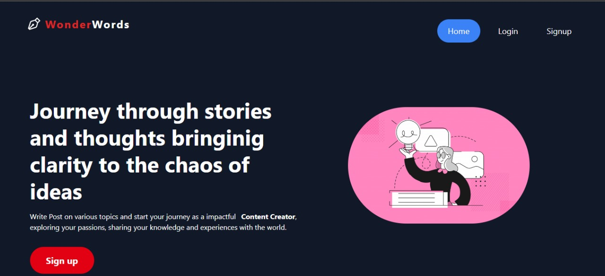

# WonderWords - Journey Through Stories and Thoughts

Welcome to WonderWords, where you can journey through stories and thoughts, bringing clarity to the chaos of ideas. Start your path as a content creator by writing posts on various topics, sharing your passions, knowledge, and experiences with the world.

## Screenshot 📸



## Deployed Link 🌐

Check out the live site here: 👉 [WonderWords](https://wonderword-blog-app.vercel.app/)

## Table of Contents

- [Project Structure](#project-structure)
- [Technologies Used](#technologies-used)
- [Libraries Used](#libraries-used)
- [Description](#description)
- [Features](#features)
- [Getting Started](#getting-started)
- [Usage](#usage)
- [Contributing](#contributing)
- [Acknowledgments](#acknowledgments)

## Project Structure

- **index.html**: The main HTML file.
- **features**: Contains all state management slices.
- **main.jsx**: Handles the routing of the app.
- **appwrite**: Contains API calls for Appwrite to get, edit, and delete posts.

## Technologies Used 🛠️

- ReactJS
- Tailwind CSS
- JavaScript
- Redux Toolkit
- Appwrite

## Libraries Used 🛠️

- react-datepicker
- react-share
- react-hook-form
- html-react-parser
- react-icons

## Description 📝

WonderWords is a user-friendly web application that allows users to create, read, update, and delete blog posts. It provides detailed information about each blog, including the title, content, and associated tags. Users can comment on and like blog posts, fostering a community of content creators.

## Features ✨

- User-friendly interface
- User authentication and authorization with Appwrite
- Rich text editor for writing blogs
- Responsive design for both mobile and desktop
- Save and like functionality

## Getting Started 🏁

To run the project locally, follow these steps:

1. Clone the repository:

    ```bash
    git clone https://github.com/Xensen008/WonderWord-BlogApp/
    ```

2. Navigate to the project directory:

    ```bash
    cd WonderWord-BlogApp
    ```

3. Install the required Node modules:

    ```bash
    npm install
    ```

4. Configure Appwrite using `.env.sample`

5. Run the development server:

    ```bash
    npm run dev
    ```

6. Open your browser and go to:

    ```bash
    localhost:5173
    ```

## Usage

1. **Sign Up or Log In**

   Create a new account or log in with an existing one.

2. **Create a Blog**

   Click on "Create New Blog" and start writing using the rich text editor. Add categories and tags to organize your blog.

3. **Manage Your Blogs**

   Edit or delete your blogs as needed.

4. **Engage with Content**

   Comment on and like other users' blogs to interact with the community.

## Contributing

We welcome contributions to improve WonderWords! Please follow these steps to contribute:

1. Fork the repository.
2. Create a new branch: `git checkout -b feature/your-feature-name`.
3. Make your changes and commit them: `git commit -m 'Add some feature'`.
4. Push to the branch: `git push origin feature/your-feature-name`.
5. Submit a pull request.


## Authors

- [@Arnabjk008](https://www.github.com/xensen008)
- [Bio Links](https://xensen008.bio.link)


## Acknowledgments

A big thank you to the developers of ReactJS, Tailwind CSS, NodeJS, Express, and Appwrite for their incredible tools.